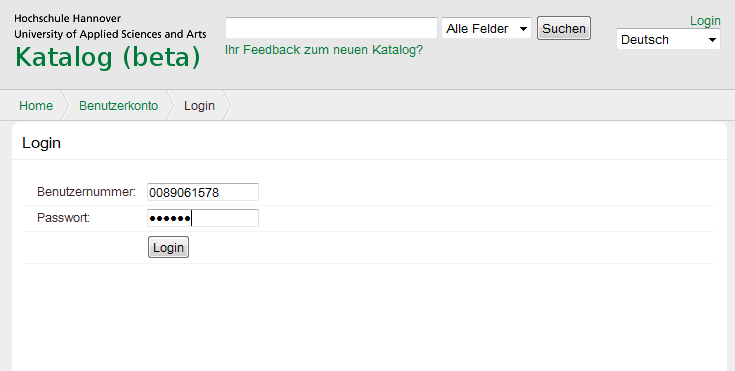
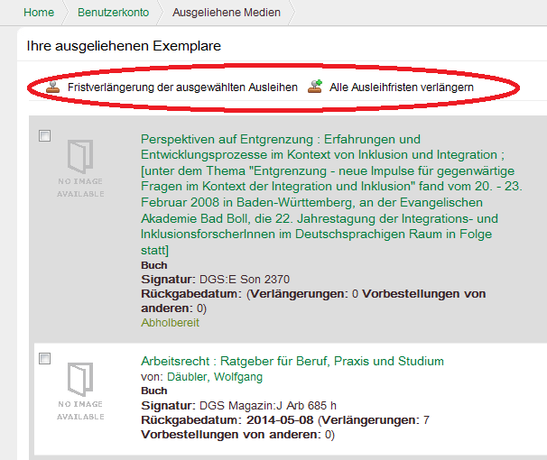
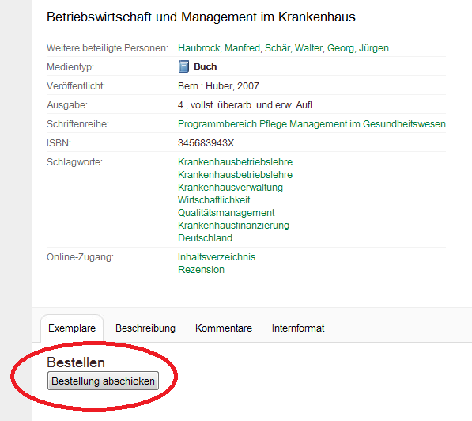
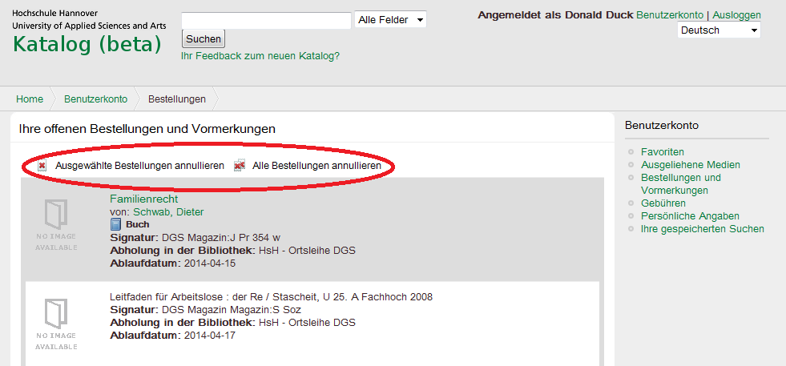
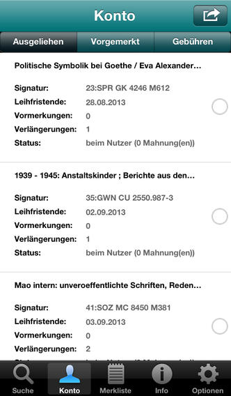

**PAIA auth: `login`** $\leftarrow$ VuFind-login

---

**PAIA core: `items`** $\leftarrow$ Liste von Ausleihen & Bestellungen\
**PAIA core: `renew`** $\leftarrow$ Verlängern

---

**PAIA core: `request`** $\leftarrow$ Bestellen oder Vormerken

---

**PAIA core: `cancel`** $\leftarrow$ Bestellungen annullieren

## Benutzerkonto-Funktion in BibApp

* Entwickelt auf Basis der (frühen) PAIA-Spezifikation
    * effective WEBWORK GmbH 
* Inzwischen umgestellt auf PAIA 1.0

---

# Technische Entwicklung

## Ohne Benutzerkonto-Schnittstelle

Ausleihsystem\
\ $\Longrightarrow^{HTML}$ Benutzeroberfläche

Ausleihsystem\
\ $\Longrightarrow^{Gefrickel}$ Anwendung

## Einführung der Benutzerkonto-Schnittstelle

1. Ausleihsystem\
   \ $\Longrightarrow^{HTML}$ Benutzeroberfläche \
   \ $\Longrightarrow^{Screenscraping}$ PAIA-Wrapper\
   \ $\Longrightarrow^{PAIA}$ Anwendung

2. Ausleihsystem\
   \ $\Longrightarrow^{PAIA}$ Anwendung

## PAIA-Implementierungen: Server

* Wrapper für das LBS3-OUS-Benutzerinterface
* Server für das LBS3 (eingeschränkt auch LBS4)
* Server für das LBS4 (in Arbeit)
* Eigene Entwicklung der UB Bochum (in Arbeit)
* ...

## PAIA-Implementierungen: Clients/Anwendungen

* VuFind-PAIA-Treiber
* BibApp
* Webclient zum Testen (JavaScript/HTML)
* Kommandozeilen-Client ([App::PAIA](https://metacpan.org/pod/distribution/App-PAIA/bin/paia))
* Weitere Ideen
    * Einbindung in Lernmanagement-Systeme
    * Bücherwecker
    * ...

# Ausblick

## PAIA-Service an der VZG

* Einrichtung & Hosting von PAIA-Server für PICA LBS
* `https://paia.gbv.de/isil/{ISIL}`
* Letzte Performance-Tests
* Preis- und Warteliste

## PAIA für weitere Bibliotheken

Weitere Bibliotheks- bzw. Ausleihsysteme

* Hersteller ansprechen
* Wrapper bauen

## OAuth 2.0 für PAIA auth

> Die Anwendung 'Bücherwecker' möchte auf Ihr Benutzerkonto mit 
> folgenden Rechten zugreifen: 
> 
> * Ausleihen und Vorbestellungen einsehen
> * Ausleihen verlängern
>
> [OK] [Ablehnen]

## Darüber hinaus

In PAIA nicht vorgesehene Informationen und Funktionen\
(bspw. Benutzergruppen, Kontaktdaten...)

* Erweiterung der PAIA-Spezifikation:\
  <https://github.com/gbv/paia/issues>

* ergänzende APIs spezifizieren und umsetzen

## Weitere Informationen

* PAIA-Spezifikation\
  <http://gbv.github.io/paia>
* Einführung und PAIA-Service der VZG\
  <https://www.gbv.de/wikis/cls/PAIA>

**Open Source**

BibApp
  : <https://github.com/gbv/bibapp-ios>\
    <https://github.com/gbv/bibapp-android>
VuFind
  : <http://vufind.org/>
CLI-Client
  : <https://metacpan.org/release/App-PAIA>

